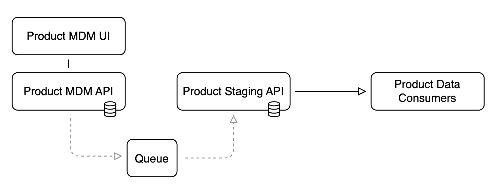

# Commerce Context

This is a project to simulate and prove conceptually the data flow of product, catalog, and pricing data in an e-commerce context. There will be multiple UIs (Product MDM, Pricing MDM, Inventory MDM, ERP, and an E-commerce Site) each running on port in the 3000 range (3001, 3002, 3003,l etc.). Each UI (React 19 with Tailwindcss) will have it's own API (on port 600*). All application will share the same 'physical' PostgreSQL database (on port 5432) with multiple schemas, one for each application. Consumer systems (Pricing MDD, Inventory MDM, E-Commerce, and the ERP system) have Ingest Services (on port 900*) to respond to messages published by the Product MDM. The Product MDM will publish messages to a NATS streaming server (on port 4222) for products that have been "launched" (in the product MDM workflow) and the consumer apps will read messages from the NATS server and keep their copies of product data in sync.

## Table of Contents
[Architectural Overview](#architecture-overview)<br/>
[Project Folder Structure](#project-folder-structure)<br/>
[Port Map](#port-map)<br/>
[Architectural Todos](#architecture-todos)<br/>
[Functional Todos](#functional-todos)<br/>
[Distributed Product Schema](#distributed-product-data-schema)<br/>
[Database Architecture](#database-architecture)<br/>
[Product MDM (system-of-record](#product-mdm-system-of-record)<br/>
[Product Data Flow](#product-data-flow)<br/>
[Authentication](#authentication)<br/>
[Draft Workflow](#draft-workflow)<br/>
[Product Data Maintenance](#product-data-maintenance-and-federation)<br/>
[Data Dictionary](#data-dictionary)<br/>
[Session Style](#session-style)<br/>

## Architecture Overview


## UI Layout


## Ecommerce Funnel


## Market Segmentation


## Project Folder Structure

The "cloud" folder should include any resources that are shared by all application (database, caching, etc.).

```
commerce-ctx
├── cloud
│ └── database
├── commerce-dashboard
│ └── ui
├── customer-mdm
│ └── ui
├── dotnet-services
│ └── src
|  ├── Commerce.Services.Customer.Api
|  ├── Commerce.Services.Ecommerce.Api
│  ├── Commerce.Services.Erp.Api
│  ├── Commerce.Services.InventoryMdm.Api
│  ├── Commerce.Services.PricingMdm.Api
│  ├── Commerce.Services.ProductMdm.Api
│  ├── Commerce.Services.ProductStaging.Api
│  ├── Commerce.Services.Shared.Data
│  ├── Commerce.Services.Shared.Infrastructure
│  ├── Commerce.Services.Shared.Models
│  └── Commerce.Services.UserMdm.Api
├── ecommerce
│ └── ui
├── erp
│ └── ui
├── inventory-mdm
│ └── ui
├── order-management-system
│ └── ui
├── erp
│ └── ui
├── pricing-mdm
│ └── ui
├── product-mdm
│ └── ui
└── product-staging (server only)
  └── src
```

## Port Map (APIs DO NOT RUN ON LOCALHOST:PORT, THEY RUN IN DOCKER CONTAINERS IN TRAEFIK)

|Layer|Technology|Product|P.Staging|Pricing|E-comm|OMS|ERP|Customer|C.Staging|Pr.Staging|Localization|Averis System|
|:-|:-|:-:|:-:|:-:|:-:|:-:|:-:|:-:|:-:|:-|:-|:-|
|UI|Vite|3001|-|3003|3004|3005</span>|3006</span>|3007|||3010|3012|
|API|.net|6001|6002|6003|6004|6005</span>|6006</span>|6007|6008|6009|6010|6012|
|Ingest|.net|-|9002|-|-|-|-|-|9008|9009|||
|Database|PostgreSQL|5432|5432|5432|5432|5432</span>|5432|5432|5432|5432|5432|5432|
|Queuing|NATS|4222|4222|-|-|-|-|-|-|-|-|-|-|
|Notifications|Socket.io|Pub:|Sub:|Pub:|Pub:|Sub: / Pub:|Sub:|Pub:|Sub:|Sub:|Pub: multiple|-|

## Docker/Traefik Build Environment To-dos

**All services are running in Traefik as individual Docker containers.**

|Component|Layer|Docker Name|Port|Complete|
|:-|:-|:-|:-|:-:|
|Traefik|infrastructure|averis-traefik|80, 443, 8080|✅|
|PostgreSQL|infrastructure|commerce-postgres|5432|✅|
|NATS|infrastructure|averis-nats|4222, 8222|✅|
|System UI (dashboard)|ui|averis-system-ui|3012|-|
|Product UI|ui|averis-product-ui|3001|🔧|
|Pricing UI|ui|averis-pricing-ui|3003|-|
|Customer UI|ui|averis-customer-ui|3007|-|
|Ecomm UI|ui|averis-ecomm-ui|3004|-|
|OMS UI|ui|averis-oms-ui|3005|-|
|ERP UI|ui|averis-erp-ui|3006|-|
|System API|api|averis-system-api|6012|✅|
|Product API|api|averis-product-api|6001|✅|
|Product Staging API|api|averis-product-staging-api|6002|✅|
|Pricing API|api|averis-pricing-api|6003|✅|
|Pricing Staging API|api|averis-pricing-staging-api|6009|-|
|Customer API|api|averis-customer-api|6007|✅|
|Customer Staging API|api|averis-customer-staging-api|6008|✅|
|Ecomm API|api|averis-ecommerce-api|6004|🔧|
|OMS API|api|averis-oms-api|6005|✅|
|ERP API|api|averis-erp-api|6006|✅|
|Product Staging Ingest|ingest|averis-product-staging-ingest|9002|✅|
|Pricing Staging Ingest|ingest|averis-pricing-staging-ingest|9009|-|
|Customer Staging Ingest|ingest|averis-customer-staging-ingest|9008|-|


## Microservices Architecture & DB Schema Alignment
THe Averis system follows Domain-Driven-Design and a Microservices architecure by separating different domains into different database schemas. Access to the tables in each schema should ONLY ever be allowed from the domain's API layer (there should **never** be SQL JOINs between db schemas):

|Domain|Traefik URL|API Port|Schema Name|Domain Objects|
|:-|:-|:-|:-|:-|
|System|api.localhost/system|6012|averis_system|users, settings, database_schema|
|Product|api.localhost/product|6001|averis_product|product|
|Product Staging|api.localhost/product-staging|6002|averis_product_staging|product (staging)|
|Pricing|api.localhost/pricing|6003|averis_pricing|region, country, local, catalog, catalog_product|
|Pricing Staging|api.localhost/pricing-staging|6009|averis_pricing_staging|region, country, local, catalog, catalog_product (staging)|
|Customer|api.localhost/customer|6007|averis_customer|customer|
|Customer Staging|api.localhost/customer-staging|6008|averis_customer_staging|customer (staging)|
|Ecomm|api.localhost/ecomm|6004|averis_ecomm|...|
|Order Mgmt. System|api.localhost/oms|6005|averis_oms|quote, order|
|Enterprise Resource Planning (accounting)|api.localhost/erp|6006|averis_erp|order, account|
|Localization|api.localhost/localization|6010|averis_pricing|product_locale_content, product_locale_financials|
## Database Architecture

### Averis Platform Schema Architecture

The platform uses a **federated schema approach** with clear domain boundaries and centralized system management:

```
Averis Platform Database (commerce_db)
├── averis_system           # Internal platform management
│   ├── users               # Consolidated employee/system accounts
│   ├── data_dictionary     # System-wide metadata definitions
│   ├── audit_logs          # Cross-system audit trail
│   └── system_settings     # Platform configuration
│
├── averis_customer         # Customer lifecycle management
│   └── customers           # External customer data with graduated disclosure
├── averis_customer_staging # Customer staging
│   └── customers           # External customer data with graduated disclosure
│
├── averis_product          # Product master data (system of record)
│   └── products            # Products
├── averis_product_staging  # Read-optimized product cache
│   └── products            # Product staging
│
├── averis_pricing          # Pricing and catalog management
├── averis_pricing_staging  # Pricing/catalog staging
│
├── averis_ecomm            # Customer-facing commerce functionality
├── averis_erp              # ERP functionality
└── averis_oms              # OMS functionality
```

**Key Design Principles:**
- **Clear Trust Boundaries**: Internal users (`averis_system`) vs external customers (`averis_customer`)
- **Domain Ownership**: Each schema owned by specific services with clear responsibilities  
- **Data Federation**: Command (Product MDM) separate from Query (staging/consumers)
- **Graduated Disclosure**: Customer data evolves from Cold → Warm → Hot authentication levels

### Distributed Product Data Schema

The Product MDM will be the authoratative source of truth for product data and, as such, will have the most comprehensive data schema. The Product Staging system will store a read-only copy of the product schema. All other platform systems will read from the Product Staging to retrieve specific product data attributes needed by those systems.

### Product MDM (System-of-Record)

The Product MDM database design uses a hybrid approach combining relational structure with document-style flexibility. Core business attributes get dedicated columns for performance and querying, while variable/extensible attributes use JSONB for schema
flexibility. This balances query performance with adaptability - better than pure EAV (5th normal form) for most use cases.

#### Fixed Relational Columns (Core Business Attributes):
- id, sku, name, description - Core identifiers
- brand, manufacturer - Key business dimensions
- status, is_active - Lifecycle management
- category_id - Relational foreign key to categories table
- Audit columns (created_at, updated_at, etc.)

#### JSONB Columns (Flexible Schema):
- attributes - Variable product attributes (technical specs, features, etc.)
- metadata - System metadata, workflow data, approvals, etc.

#### Separate Tables (Normalized):
- categories - Product categorization hierarchy
- attributes - Attribute definitions and validation rules
- product_variants - Size/color/configuration variants

**Note:** User management has been centralized into the `averis_system` schema to maintain clean separation between internal platform users and external customers.

#### Why This Hybrid Approach?

1. Performance: Core business queries use indexed columns
2. Flexibility: JSONB allows schema evolution without migrations
3. Practicality: Avoids the complexity of pure EAV/5th normal form
4. Modern Best Practice: Leverages PostgreSQL's excellent JSONB support

#### Data Storage Pattern:

```
// Fixed columns
sku: "WIDGET-001"
name: "Premium Widget"
brand: "Acme Corp"

// JSONB attributes column
attributes: {
    "technical_specs": {
        "weight": "2.5kg",
        "dimensions": "10x5x3cm",
        "material": "aluminum"
    },
    "marketing": {
        "key_features": ["waterproof", "durable"],
        "target_audience": "professionals"
    }
}
```
This gives both the query performance of relational design and the flexibility of document storage.

## Authentication

|System|Host|Username|Password|API Key|
|:-|:-|:-|:-|:-|
|US Trade.gov (primary)||||[API_KEY_REQUIRED]|
|US Trade.gov (secondary)||||[API_KEY_REQUIRED]|
|Google Translate API||||[API_KEY_REQUIRED]|
|PostgreSQL|commerce-postgres:5432|[USERNAME]|[PASSWORD]||

Stytch is used for authentication and the commerce context will correlate authenticated users with user profiles in the system. It will also attempt to correlate authenticated users to known customers.\

|Stytch System Role|Description|
|:-|:-|
|admin|**System administrator** - should be able to do *anything*.
|user_admin|**User admin** - Users are created when someone authenticates for the first time and they inherit the roles defined for them in Stytch. This role can update user profile information.|

|Stytch Pricing Role|Description|
|:-|:-|
|pricing_mdm|Allows users to access the Averis Pricing module.|
|catalog_amer|Gives the user the right to create and maintain catalogs in the Americas region.|
|catalog_emea|Gives the user the right to create and maintain catalogs in the Europe-Middleast-Africa region.|

|Stytch Product Role|Description|
|:-|:-|
|product_mdm|Gains the user access to the Averis Product module.|
|product_marketing|Product marketing data maintainer.|
|product_marketing_approve|Product marketing data maintainer/approver.|
|product_legal|Product legal data maintainer.|
|product_legal_approve|Product legal data maintainer/approver.|
|product_finance|Product finance data maintainer.|
|product_finance_approve|Product finance data maintainer/approver.|
|product_salesops|Product sales/operations data maintainer.|
|product_salesops_approve|Product sales/operations data maintainer/approver.|
|product_contracts|Product contracts data maintainer.|
|product_contracts_approve|Product contract data maintainer/approver.|
|product_launch|Can "launch" a product (set its status to 'active' and release it to the **Product Staging** environment).|

## Product Data Maintenance and Federation

The ProductMDM application is the authoratative source for the creation and maintenance of product data. It employes a federated data architecture to support the separation of command and query execution.



### Command
The Product MDM is the system-of-record and the source of creation and maintenance of product data. Once the product data workflow is fulfilled and a product is ready for launch (put in 'active' status), the product data is published via a queuing system and consumed by the Product Staging Ingest service.

### Distributed Data Stewardship and Approval Workflow
There are five categories of product data attributes: Marketing, Legal, Finance, Sales Ops, and Contracts. The Product Maintenance screen should break these into fve sections, allowing only users with the appropriate role (product_marketing, product_legal, product_finance, product_salesops, and product_contracts) to update data in each section. Once the data is entered only users with an appropriate approval role (e.g. product_marketing_approve) is able to "approve" that section of attributes. Only when all five sections are approved is someone with the role "product_launch" able to 'launch' the product (place it in 'active' status) at which point the system will message the product data downstream for synchronization with the product_staging.products table (from which all other components in the system retrieve product data - CQRS).

### Query

The Product Staging processes messages to keep it's data store in-sync and made available for enterprise queries.

## Draft Workflow

The Product MDM will employ a workflow in which five different roles or business units will be responsible for the completion of specific attributes in creating and maintaining a product definition. The five areas of distinct attribution (and their roles) are: Marketing ('product_marketing'), Legal ('product_legal'), Finance ('product_finance'), SalesOps ('product_salesops'), and Contracts ('product_contracts'). There are also separate roles for each area ('product_*_approve') with the added responsibility of 'approving' those attributes for launch. Various product attributes are required, but validation of these attributes should only be applied when the section (tab) of attributes is being approved by a user with an appropriate approver role. In 'draft' status, the product data should be able to be created and updated in any state.


Once an approval is garnered for each area, the product can be launched (and thus messaged to Product Staging) by a user with the luanch role ('product_launch'). The system utilizes a validation-free workspace while the product is in 'draft' status. This approach mirrors how modern product management tools work - GitHub allows "draft" pull requests, Figma allows incomplete designs, and Notion allows draft pages. It separates data entry from quality gates, enabling iterative collaboration while maintaining quality standards at the right moment.

## Pricing MDM

The Pricing MDM system will require a view of product data when creating or maintaining catalogs. This view should come directly from the Product Staging API. The only product-related data that should be stored in the Pricing MDM database are the data representing catalogs and their metadata and the product ID (and SKU codes) for included products, along with pricing-specific metadata.

## Ecommerce MDM

The e-commerce application should render data dynamically from calls to the Product and Pricing MDM APIs. First, a catalog is retrieved from the Pricing MDM API to determine which products ae available and their customer-specific pricing. Product details should be retrieved from the Product Staging API for rendering. In-memory caching can be implemented for each consumer of the Product Staging data.

## Data Dictionary

There is a data dictionary defined containing all the columns in the Product MDM product database. The data dictionary will define metadata for each column, including: Display Value, Required, MaintenanceRole, SchemasPresent (ProductMDM, PricingMDM, Ecommerce).

## Session Style:

You are an expert in distributed, microservices architectures and React (Typescript), SQL, REST and HTML patterns in general. During the work session we will be using React (Typescript) for front-end development, Express for stand-alone servers and REST APIs. Coding standards should follow the Google Typescript Style Guide located here: https://google.github.io/styleguide/tsguide.html. README.md files should be created for all top-level folders describing the software contained therein, how to run it, on which port it runs and how to access it. When referring to files and folders for this project, just assume the '~/Documents/source/github/Eric-Brand_swi/eb' prefix. and start paths with '/' representing the '~/Documents/source/github/Eric-Brand_swi/eb/commerce-ctx' folder. So '~/Documents/source/github/Eric-Brand_swi/eb/commerce-ctx/product-mdm/ui/src/main.jsx' would become '/product-mdm/ui/src/main.jsx'.

For key points in the architecture and development feel free to ecxplain what you ae doing and why. Don't feel the need to do this for everything soas to not waste tokens.

When asked to solve a problem, take a step-by-step approach, investigate thoroughly before deciding on a solution, scan the entire codebase to understand what implications specific changes will have and attempt to identify all areas of the application where changes for a specific fix are required. Also, when finished with a specific implementation don't be so confident of your fix without testing the results and take the approach that spcific changes, while possibly successful could also have had unexpected repercussions on the code base that only user testing would uncover. Check your work for simple syntax and logic errors. When possible, spin up a Chrome browser process and validate UI changes by loading the page and monitoring the cnsole output directly.