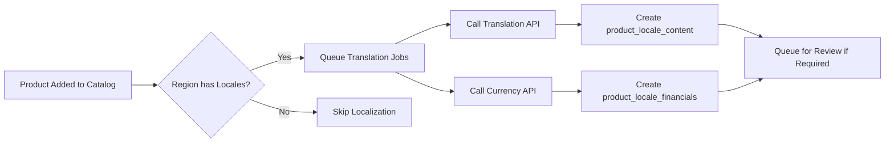

# Production Locale Integration Architecture

## Automated Content Localization Pipeline

### 1. Product Catalog Assignment Trigger

### 2. Required External Services

#### Translation Services
- **Primary**: DeepL API (highest quality for business content)
- **Fallback**: Google Translate API (broader language support)
- **Custom**: Industry-specific terminology APIs
- **Human Review**: Integration with translation management platforms

#### Currency Services
- **Primary**: European Central Bank (ECB) for EUR rates
- **Secondary**: Federal Reserve for USD base rates
- **Commercial**: ExchangeRate-API for real-time updates
- **Backup**: Local rate caching with manual overrides

### 3. Administrative Interfaces Required

#### A. Locale Management
- Locale CRUD operations
- Currency assignment and formatting rules
- Regional tax rate configuration
- Date/number format templates

#### B. Catalog-Locale Matrix
- Visual association management
- Bulk assignment operations
- Localization status dashboards
- Missing translation reports

#### C. Translation Workflow
- Queue management interface
- Quality review workflows
- Translator assignment system
- Translation memory integration

#### D. Currency Management
- Exchange rate monitoring
- Rate change alerts
- Historical rate analysis
- Manual rate override capabilities

### 4. Production Considerations

#### Performance
- Background job processing for translations
- Caching strategies for exchange rates
- CDN integration for localized content
- Database indexing for locale queries

#### Quality Assurance
- Translation quality scoring
- A/B testing for localized content
- Cultural appropriateness validation
- Legal compliance checking

#### Monitoring & Analytics
- Translation cost tracking
- Localization coverage metrics
- User engagement by locale
- Conversion rate analysis by region

## Implementation Priority

1. **Phase 1**: Admin interfaces for manual locale management
2. **Phase 2**: Translation API integration with basic automation
3. **Phase 3**: Currency conversion automation with rate monitoring
4. **Phase 4**: Advanced workflow management and quality assurance
5. **Phase 5**: Analytics and optimization tools